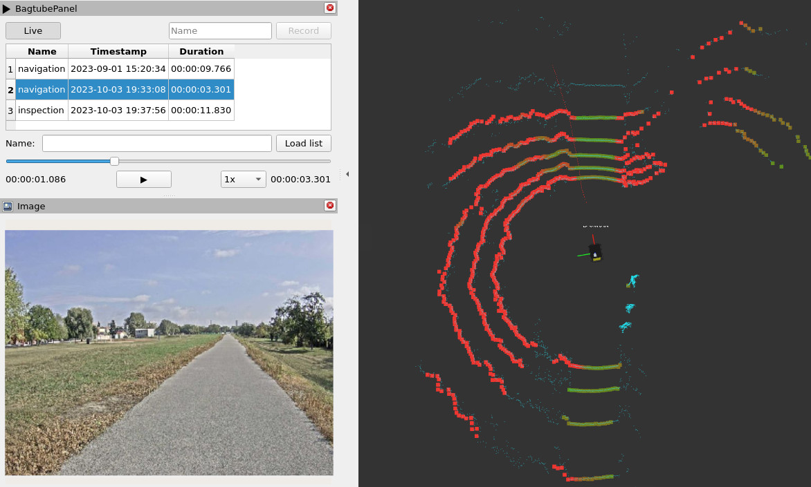

# bagtube
A simple bag/live topic player for ROS2.
It is intended to be used for remote monitoring of robot operation.

## Server
The basic mechanism of bagtube is republishing of live/bag topics to new topics on demand,
so that a remote communication protocol (e.g. Zenoh) can be configured to stream only the new topics,
sparing the bandwidth during periods when robot activity is of no interest for the user.

### Features
- Livestreaming ROS2 topics on demand (i.e. toggling republish on/off) via `enable_livestream` service
- Recording bags via `record_bag` action
- Calling additional `SetBool` services on start/stop of recording/livestreaming (specified via `toggle_input_nodes_running_services` parameter,
see [example config](params/chatter_camera.yaml))
- Listing recorded bags via `get_bag_list` service
- Editing bag name and deleting bags via `edit_bag` service
- Limiting total used storage via `max_total_size_gb` parameter
- Playback via `play_bag` action
- Playback control via `control_playback` service (play/pause/seek/set_rate)
- Sending preview snapshots after each seek (optional if `snapshot_bag_stamp` is specified in `control_playback` service)

## Client
The client is a simple RViz2 panel as an example of controlling bagtube server. It is basically a "video player/recorder" for ROS2 topics.


## Example

Installation:
```bash
sudo apt install ros-iron-ros-base ros-iron-rviz2 ros-iron-demo-nodes-cpp ros-iron-usb-cam
cd ~/my_ws/
. /opt/ros/iron/setup.bash
colcon build --symlink-install
```
Running server and rviz2 with bagtube panel example:
```bash
. ~/my_ws/install/setup.bash
ros2 launch bagtube chatter_camera.launch.py
```
Note: the annoying 'Hello world' logging node is just an example that bagtube is not only a video player, but it can be configured
for any number of topics of any types (see [config](bagtube_server/params/chatter_camera.yaml)). You can see the streamed messages
(during livestream/playback) via:
```bash
. /opt/ros/iron/setup.bash
ros2 topic echo /chatter_stream
```